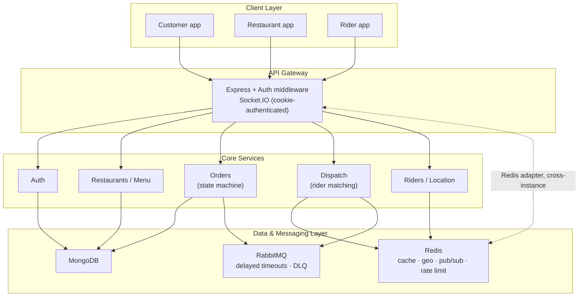
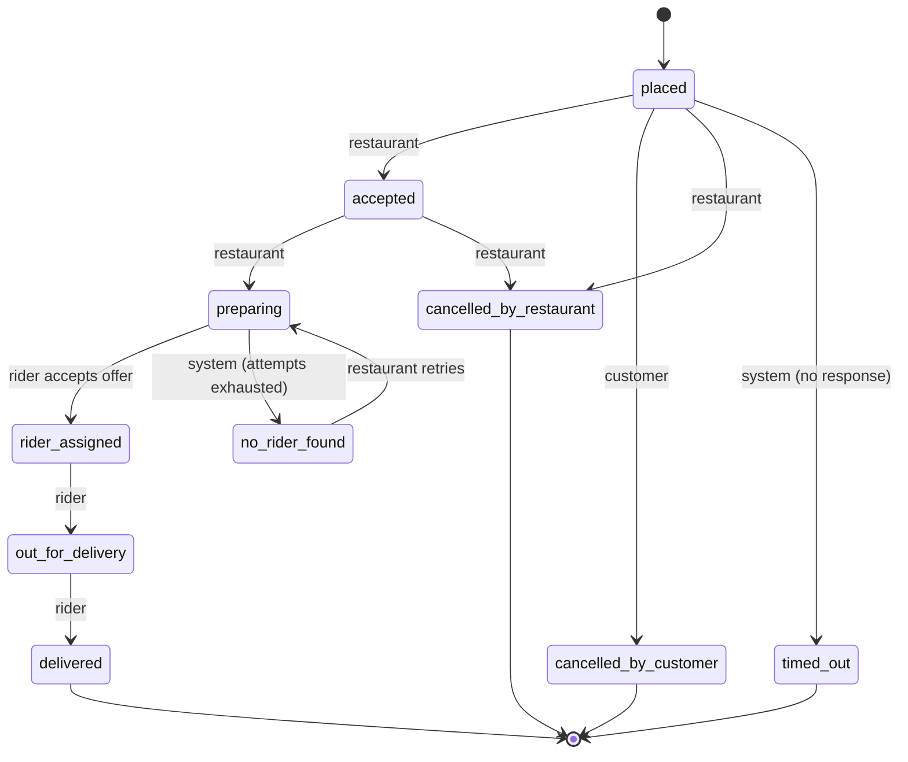

# DispatchX

**A real-time food delivery dispatch platform** built on the MERN stack, engineered to demonstrate production-grade system design: event-driven architecture, horizontally-scalable real-time infrastructure, geospatial matching, and a fully modeled order state machine.

This isn't a CRUD todo-app-with-auth portfolio project. DispatchX simulates the actual hard problems a food-delivery platform has to solve — keeping three independent actors (customer, restaurant, rider) in sync in real time, finding and offering deliveries to nearby riders with automatic fallback and timeout handling, and doing all of it in a way that survives running on more than one server instance.

---

## Table of Contents

- [Tech Stack](#tech-stack)
- [System Architecture](#system-architecture)
- [Order State Machine](#order-state-machine)
- [Core Features](#core-features)
- [System Design Highlights](#system-design-highlights)
- [Project Structure](#project-structure)
- [Getting Started](#getting-started)
- [Environment Variables](#environment-variables)
- [Build Journey](#build-journey)

---

## Tech Stack

**Frontend** — React 18 · TypeScript · Vite · MUI · React Router · Socket.IO Client · React-Leaflet · Axios

**Backend** — Node.js · Express · TypeScript · Mongoose (MongoDB) · Socket.IO · JWT (httpOnly cookies) · Nodemailer

**Infrastructure** — Redis (cache, pub/sub, geospatial, rate limiting) · RabbitMQ (task queues, delayed messages, dead-letter queues) · Docker Compose

**Monorepo** — pnpm workspaces, with a `shared` package providing a single source of truth for domain types, the order state machine, and transition rules, consumed by both frontend and backend with full type safety.

---

## System Architecture



Every Socket.IO instance is backed by the **Redis adapter**, meaning `io.to(room).emit(...)` correctly fans out across multiple running server processes — verified by deliberately running two independent instances on different ports and confirming a status update from one reaches a client connected to the other only once the adapter was wired in.

---

## Order State Machine

Every order is modeled as a **discriminated union** in TypeScript — each status carries only the fields that are actually guaranteed to exist at that point in its lifecycle, and every transition is validated server-side against an explicit table before it's allowed to happen.



Each arrow is enforced by a `canTransition(from, to)` check plus an actor check (`TRANSITION_ACTORS`) confirming the *specific* caller — customer, restaurant owner, assigned rider, or an internal system process — is actually allowed to trigger that specific transition.

---

## Core Features

### Authentication
- Register → email verification (link-based, via a real SMTP flow through Ethereal in dev) → login
- Access + refresh tokens as httpOnly cookies, with rotation and reuse detection (a replayed refresh token invalidates the entire session)
- Role-based access control across three roles: customer, restaurant, rider

### Restaurants & Menu
- Full CRUD with ownership authorization
- Multi-restaurant support per owner, with a shared "currently selected restaurant" context
- Geospatial "restaurants near me" via MongoDB `2dsphere` + `$near`

### Orders
- Price computed and snapshotted server-side — never trusted from the client
- Idempotency-key middleware protecting order creation from duplicate submission (double-click, retry-on-timeout)
- Full lifecycle tracked with per-transition timestamps

### Real-Time Layer
- Socket.IO with cookie-based authentication (reusing the same JWT as REST, no separate token)
- Per-order rooms, joined both on-demand and eagerly on connect (so a user is notified of active-order changes regardless of which page they're on)
- Horizontally scalable via the Redis adapter — proven by intentionally breaking and then fixing cross-instance delivery

### Dispatch Engine
- Order enters `preparing` → publishes to a RabbitMQ queue → dispatch consumer finds the nearest **online** rider via a combined Redis geo-search + MongoDB status filter
- Offer sent to the rider's personal socket room, with a RabbitMQ **delayed message** (TTL + dead-letter exchange trick — no native delay support in RabbitMQ) standing in for the offer's response window
- Decline or timeout automatically advances to the next-nearest candidate; a capped number of attempts falls back to a `no_rider_found` state the restaurant can manually retry from

### Live Location Tracking
- Rider position written to Redis via `GEOADD`, read via `GEOSEARCH` — deliberately chosen over MongoDB for this specific access pattern (frequent, ephemeral writes)
- Position streamed live into the order's room as the rider's background ping loop fires
- Customer sees a live-updating map (React-Leaflet); rider sees their own live position against a destination marker that switches from pickup to drop-off at the right moment

### Reliability & Abuse Prevention
- RabbitMQ dead-letter queues for failed async work (e.g. a failed verification email is parked for inspection rather than retried forever or silently dropped)
- Redis-backed sliding-window rate limiting (sorted-set based, not fixed-window) on auth and mutation-heavy endpoints

---

## System Design Highlights

A quick reference for what this project actually demonstrates, beyond "used technology X":

| Concept | Where it shows up |
|---|---|
| Event-driven architecture | RabbitMQ producers/consumers for email, order timeout, dispatch, offer timeout |
| Task queue vs. work delivery guarantees | Dead-letter queues, `ack`/`nack`, deliberate no-retry vs. retry decisions per pipeline |
| Delayed execution without native support | TTL + DLX "delay trick" for both order auto-reject and rider offer timeouts |
| Horizontal scaling of stateful real-time systems | Socket.IO + Redis adapter, verified with two independently-run server instances |
| Geospatial data modeling | MongoDB `2dsphere` for mostly-static restaurant locations vs. Redis geo commands for high-frequency rider location |
| Idempotency | Redis `SET NX` atomic claim + response caching middleware |
| Type-safe state machines | Discriminated unions modeling every order status, shared verbatim between frontend and backend |
| Authorization boundaries | Every mutation checks identity from a server-verified source (JWT), never from client-supplied data |
| Circular dependency resolution | Diagnosed and resolved a real module-load-order bug between the order and dispatch services |

---

## Project Structure

```
dispatchx/
  apps/
    client/
      src/
        components/      Reusable UI: maps, order cards, the delivery-offer modal
        context/          AuthContext, SocketContext, SelectedRestaurantContext, NotificationContext
        hooks/            useOrderTracking, useRiderLocationTracking
        lib/               api.ts (axios + interceptors), ApiError
        pages/             Route-level screens per role
    server/
      src/
        configs/           Mongo, Redis, RabbitMQ connection setup
        modules/
          auth/             User model, register/verify/login/refresh/logout
          restaurants/       Restaurant + MenuItem models and CRUD
          orders/            Order model, state machine service, timeout consumer
          dispatch/          Rider model, matching logic, offer/dispatch consumers
        shared/
          middlewares/       auth, error handling, request logging, idempotency, rate limiting
          utils/             logger, error classes, mailer, email templates
  packages/
    shared/
      src/index.ts         Domain types, the Order discriminated union, transition tables —
                            imported by both apps so frontend and backend can never disagree
                            about what a valid order looks like
```

Every folder in this tree contains real, working code — there's no placeholder scaffolding left over from earlier planning that didn't pan out (a `location/` module and a dedicated `sockets/` folder were sketched early on but never used, since that logic ended up living inside `dispatch/` and `app.ts` respectively as the project evolved).

---

## Data Models

| Model | Key fields | Notes |
|---|---|---|
| `User` | `email`, `hashedPassword`, `role`, `isVerified` | Single source of truth for identity across all three roles; never duplicated elsewhere |
| `Restaurant` | `ownerId`, `address.location` (GeoJSON `Point`), `operatingHours` | `2dsphere` indexed for proximity search |
| `MenuItem` | `restaurantId`, `itemPrice` (integer, smallest currency unit), `isAvailable` | Prices stored as integers deliberately — floating point is never used for money |
| `Order` | `status` (discriminated union), `items` (price/name **snapshotted** at order time), `deliveryAddress`, `triedRiderIds`, `riderId` | The core state-machine-driven model; see [Order State Machine](#order-state-machine) |
| `Rider` | `userId`, `vehicleInfo`, `isOnline`, `ordersCompleted` | No `name` field — deliberately reads from `User` via `.populate()` rather than duplicating a fact that could drift out of sync |

---

## API Reference (selected endpoints)

| Method & Path | Purpose |
|---|---|
| `POST /auth/register` → `/auth/verify-email/:token` → `/auth/login` | Full signup flow with real email verification |
| `POST /auth/refresh-token` | Rotates access + refresh tokens, detects and reacts to token reuse |
| `GET /restaurant/nearby` | `$near` geospatial query, sorted by proximity |
| `POST /restaurant/create` | Idempotency-key protected |
| `POST /order/create` | Price computed server-side from live menu data, never trusted from the client |
| `PATCH /order/:id/status` | The single endpoint every status transition flows through — validated against the transition table and the caller's actual relationship to the order |
| `POST /order/:id/accept-offer` / `decline-offer` | Rider's response to a dispatch offer |
| `GET /rider/nearby` | Combined Redis geo-search + MongoDB `isOnline` filter |
| `POST /rider/location` | Requires the rider to already be online; also streams the position live into the order's room if they're on an active delivery |

---

## Real-Time Events (Socket.IO)

| Event | Direction | Purpose |
|---|---|---|
| `orderStatusUpdated` | server → order room | Fired on every status transition |
| `deliveryOffer` | server → rider's personal room | A new delivery offer, with a live countdown on the client |
| `riderLocationUpdate` | server → order room | Streamed on each location ping while the order is active |
| `joinOrderRoom` | client → server | On-demand join, in addition to eager auto-join on connect |

All socket connections authenticate via the same httpOnly JWT cookie used by REST — parsed manually from the handshake headers, since sockets don't go through Express's cookie-parser middleware automatically.

---

## RabbitMQ Queues

| Queue | Pattern | Purpose |
|---|---|---|
| `verification-email-queue` → `verification-email-dlq` | Task queue + DLQ | Async email send; failures parked for inspection, no infinite retry |
| `order-timeout-delay-queue` → `order-timeout-queue` | TTL + dead-letter delay trick | Auto-rejects an order the restaurant never responded to |
| `dispatch-queue` | Task queue | Triggers rider matching when an order enters `preparing` |
| `offer-timeout-delay-queue` → `offer-timeout-queue` | TTL + dead-letter delay trick | Detects an unanswered rider offer and retries with the next candidate |

---

## Security & Reliability Notes

- **Authorization never trusts the client.** Every identity-dependent decision (who owns this restaurant, who placed this order, who accepted this offer) is derived from the verified JWT payload, never from `req.body`.
- **Passwords** are hashed with bcrypt; comparison uses `bcrypt.compare`, never a re-hash-and-string-match (which would fail for every login, since bcrypt salts every hash uniquely).
- **Refresh tokens** are hashed before storage and rotated on every use; a reused (already-consumed) refresh token immediately invalidates the entire session, treating it as a signal of token theft.
- **Rate limiting** uses a sliding window (Redis sorted sets), not a fixed window, specifically to avoid the double-burst exploit possible at fixed-window boundaries.
- **Idempotency** on mutation-heavy endpoints uses Redis `SET NX` for an atomic claim, with the original response cached and replayed for duplicate requests — a retried request is genuinely indistinguishable from a fresh success on the client side.

---

## Getting Started

```bash
git clone <repo-url>
cd dispatchx
pnpm install

# Start infrastructure (MongoDB, Redis, RabbitMQ)
docker compose up -d

# Build the shared types package
cd packages/shared && pnpm build

# Run both apps
cd ../../apps/server && pnpm dev
cd ../../apps/client && pnpm dev
```

RabbitMQ's management dashboard is available at `http://localhost:15672` for inspecting queues live during development.

---

## Environment Variables

| Variable | Purpose |
|---|---|
| `MONGO_URI` | MongoDB connection string |
| `REDIS_URL` | Redis connection string |
| `RABBITMQ_URL` | RabbitMQ connection string |
| `JWT_ACCESS_SECRET` / `JWT_REFRESH_SECRET` | Token signing secrets |
| `SMTP_USER` / `SMTP_PASS` / `SMTP_FROM` | Nodemailer transport (Ethereal in dev) |
| `CLIENT_ORIGIN` | Allowed CORS origin for cookies/credentials |

---

## Build Journey

This project was built stage by stage, each one deliberately scoped before implementation:

1. **Foundation** — pnpm monorepo, shared types, TypeScript across both apps
2. **Auth & Core CRUD** — users, restaurants, menu items, orders
3. **Order State Machine** — discriminated unions, transition validation
4. **Async Messaging** — RabbitMQ, dead-letter queues, transactional email
5. **Real-Time Layer** — Socket.IO, room-based delivery
6. **Horizontal Scaling** — Redis adapter, verified with a real two-instance failure/fix
7. **Geospatial** — MongoDB `2dsphere`, Redis geo commands, rider profiles
8. **Dispatch Engine** — sequential offers, delayed timeouts, retry with a capped fallback
9. **Live Tracking** — location streaming, Leaflet maps on both customer and rider sides
10. **Rate Limiting** — Redis sliding-window protection on sensitive endpoints

Each stage was built to work end-to-end and be manually verified — including deliberately breaking things (killing a RabbitMQ consumer mid-message, running two server instances to watch cross-instance delivery fail) before fixing them, rather than trusting an untested implementation.